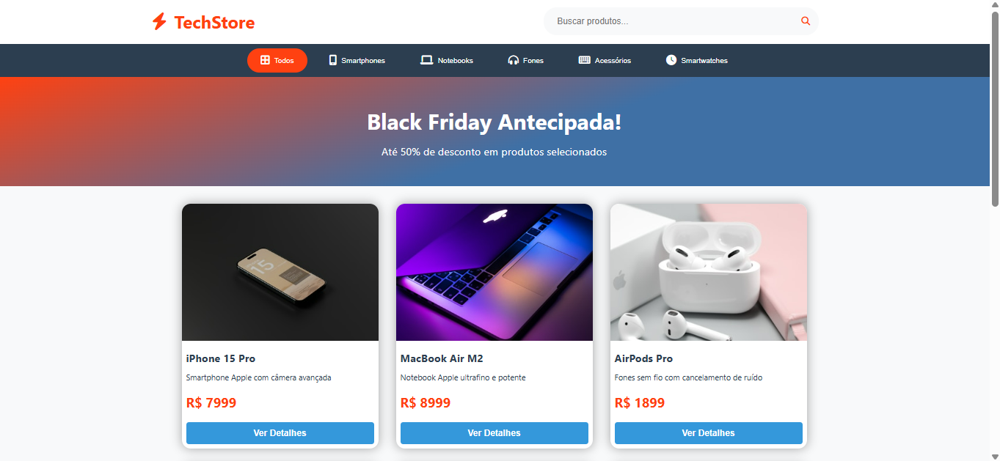

# TechStore

TechStore é uma loja online dinâmica construída com HTML, CSS e JavaScript puro. O projeto foi desenvolvido para praticar manipulação do DOM, eventos, filtros de pesquisa e categorias, além de aplicar boas práticas de estrutura e estilo.

---

## Preview do Site

---

## Funcionalidades

- Exibição dinâmica de produtos com renderização via JavaScript  
- Filtro por categoria e busca textual integrada  
- Interface responsiva com grid CSS  
- Navegação fácil e intuitiva com botões de categoria destacados  
- Atualização em tempo real conforme digitação no campo de busca  
- Feedback visual com destaque para categoria ativa  
- Layout moderno com uso de variáveis CSS e transições suaves

---

## Tecnologias utilizadas

- HTML5 semântico  
- CSS3 (variáveis, grid, transições)  
- JavaScript (ES6+, manipulação do DOM, eventos)  
- FontAwesome para ícones

---

## Como rodar o projeto

1. Clone este repositório  
2. Abra o arquivo `index.html` no seu navegador favorito  
3. Use a barra de busca para filtrar produtos pelo nome  
4. Clique nos botões de categoria para filtrar produtos por categoria  

---

## Estrutura do projeto

